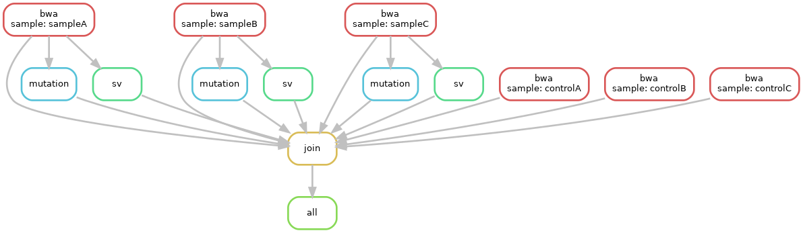

G-CAT Workflow
===============
G-CAT Workflow, a cancer genome and RNA sequencing data analysis pipeline, efficiently detects of genomic variants and transcriptomic changes. Additionally, it automatically produces rich analysis reports describing data qualities and summary of detected variants.  Users can run GenomonPipeline with ease of use in the HGC supercomputer and also can run it in other high performance computers.

## Manual
http://genomon-project.github.io/GenomonPages/

For developers, https://github.com/ncc-ccat-gap/GCATWorkflow/wiki

## Setup

0. Precondition

Make DRMAA and singularity available beforehand.

1. Install

```
git clone https://github.com/ncc-ccat-gap/GCATWorkflow.git
cd GCATWorkflow
python setup.py install
```

2. Edit sample.csv

Edit pathes of sequence files.
```
vi ./tests/dna_sample.csv
```

3. Pull container images

```
singularity pull docker://genomon/bwa_alignment:0.2.0
```

4. Edit config file

Edit `image` options, to pulled `.simg`.
And edit pathes of reference files.
```
vi ./tests/dna_genomon.cfg
```

## How to use

1. Configure

```
genomon_pipeline dna ./tests/dna_sample.csv ${output_dir} ./tests/dna_genomon.cfg
```

2. `snakemake`
```
cd ${output_dir}
snakemake
```

case, dry-run
```
snakemake -n
```

case, re-run (force all)
```
snakemake --forceall
```

case, with dot
```
snakemake --forceall --dag | dot -Tpng > dag.png
```


